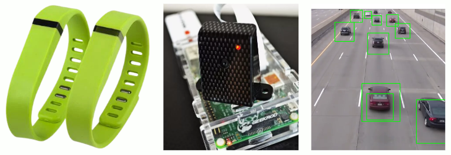
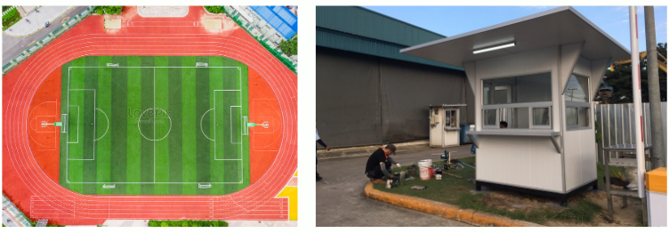
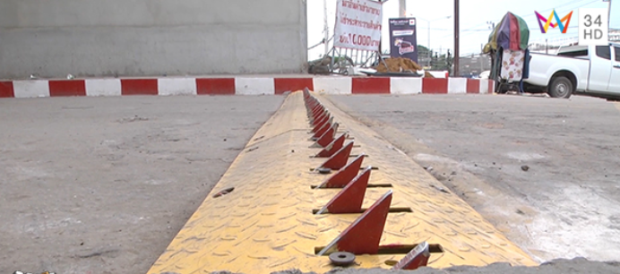
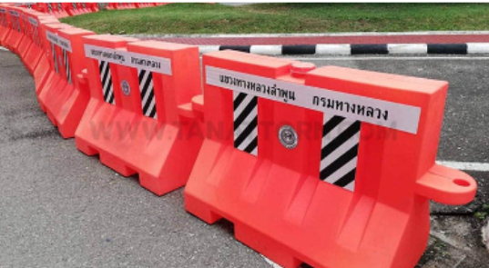

[ empathize ](empathize.md) / [ define ](define.md) / **ideate** / [ prototype ](prototype.md) / [ test ](test.md)

# Ideate

- สายรัดข้อมือ ที่จะค่อยสั่น และเปลี่ยนสีเป็นสีแดง เพื่อเตือนผู้ที่กำลังวิ่งอยู่
   --
  
  --
- สร้างสถานที่ ให้สำหรับคนวิ่งออกกำลังกาย และอาจจะมีเครื่องกีฬาอื่นในนั้น
   --
    
--
- ฟันฉลามขวางรถ จะถูกเปิดใช้งานต่อเมื่อมีรถยนต์เข้ามาให้กับลู่วิ่ง

   
  --
- Barrier พลาสติกแบบใส่น้ำมาขวางกั้นไม่ให้รถเข้ามาในเขตคนเดิน/วิ่งเพื่อความปลอดภัยของคนออกกำลังกาย
   --
  

----
