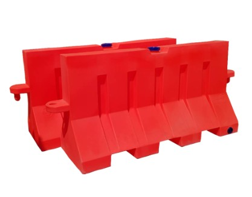

[ empathize ](empathize.md) / [ define ](define.md) / [ ideate ](ideate.md) / **prototype** / [ test ](test.md)

## Prototype
| รูป | เนื้อหา |
| --------- | ---------- |
|      |    แบริเออร์น้ำ ที่ง่ายต่อการติดตั้งและการจัดเก็บ ไม่ยุ่งยาก แถมยังไม่ทำให้การจราจรติดขัดหรือมีปัญหาใดๆ และช่วยให้พื้นที่สำหรับทางเท้าปลอดภัยมากขึ้น |
----
